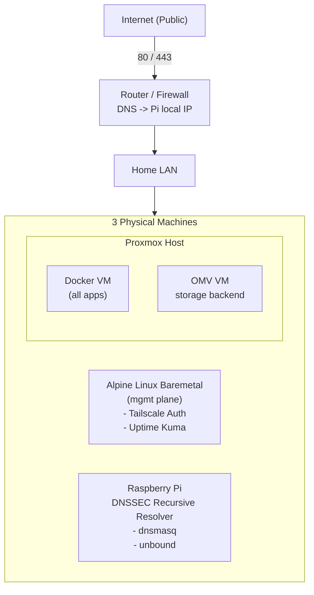

# Home Lab Architecture

My homelab runs on **Proxmox** as the baremetal hypervisor.  
Inside it I run a dedicated **Docker VM** that hosts 99% of all “apps” — containerized, minimal privileges, strict mount scopes.  
Services running on the Docker VM mount their volumes from remote storage (NFS) provided by OMV.

I also have **2 external physical machines** to separate trust domains:

- Alpine Linux box for VPN ingress + uptime monitoring
- Raspberry Pi for DNS / recursive resolver stack

This separation improves blast radius, routing control, and keeps “security plane” physically away from app workloads.

---

## High-Level Topology

---

## Inside Docker VM (services)

| Component        | Purpose |
|------------------|---------|
| Traefik          | reverse proxy + routing + TLS termination |
| Sonarr / Radarr  | media indexing / automation |
| Deluge           | non-public torrent client |
| Jellyfin         | media server |
| JellySeer        | media request platform |
| Komga            | comic / manga server |
| Calibre          | EBook server |
| Mealie           | recipe management + meal planning |
| Paperless        | document indexing and management |
| Nextcloud        | cloud sync + family photo backup |
| Portainer        | Docker visibility and mgmt |
| Homepage         | internal portal for apps |

All containers run as **dedicated non-root Unix users** matching their service identity.  
Their mounts are precise: each user only can read/write what that service actually needs.

---

## Outside Docker VM

| Component       | Purpose |
|-----------------|---------|
| Alpine Linux box | Tailscale VPN ingress + Uptime Kuma |
| Raspberry Pi     | dnsmasq + unbound (recursive DNS) |

---

## Security Model

- only **80/443** publicly exposed
- TLS termination and routing at Traefik (Docker VM)
- all admin access only over **Tailscale**
- services least privilege: UID/GID per container
- storage separated (NFS), not mount sprawl inside containers
- security plane = physically separate from app workloads

---

## Why this design?

Because this models real production principles:

- separation of privilege domains
- separation of control plane vs app plane
- rollback and snapshot ability (at Proxmox boundary)
- real threat model, not “toy homelab”

---

## Threat Model

| Threat | Vector | Impact | Mitigation |
|---|---|---|---|
| Unauthorized remote access | Internet-exposed ports | Full compromise | Only 80/443 exposed publicly, TLS at Traefik, admin only via Tailscale |
| Credential theft | browser / client compromise | Lateral move to internal apps | No password reuse, MFA where supported |
| Container breakout | 0-day in app container | VM compromise | VM boundary, limited container privileges, isolated mounts |
| Supply chain compromise | malicious image | persistent backdoor | trusted registries, reproducible images where possible |
| Privilege escalation | exploit in host components | hypervisor access | Proxmox not accessible public, admin plane separate physical box |
| Data exfiltration | ransomware / reverse shells | loss of confidentiality | minimal privileges, offline backups, split trust domains |
| DoS | flood 80/443 | outage | rate limiting on ingress |

---

## Roadmap

- deploy Vaultwarden (self-hosted Bitwarden)
- deploy Authentik as centralized identity provider (SSO, RBAC)
- deploy Mealie for recipe & meal mgmt
- implement VLAN segmentation (IoT vs Mgmt vs Media)
- OpenTelemetry pipeline (metrics, logs, traces)
- secret lifecycle automation (short lived credentials)

---

## Summary

This is a homelab intentionally treated as a real distributed system — not a toy — because this is where I experiment with the same reliability, security, isolation and identity principles used in modern backend + platform engineering.
